#Spell Master

> Master your spelling with “Spell Master”. A simple Alexa Skill to help you practice for your spelling tests.

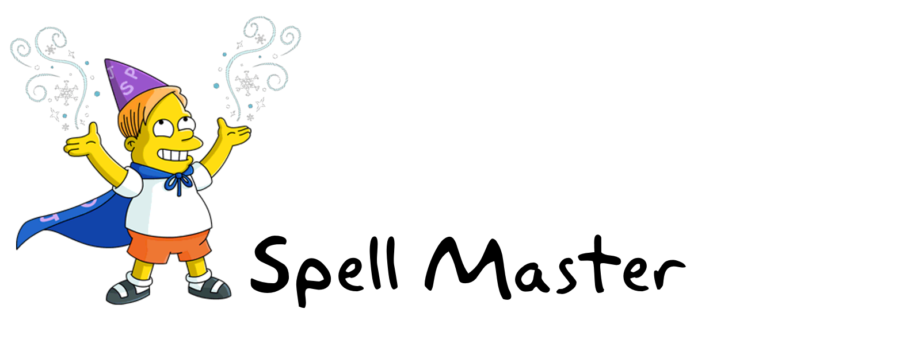

##Purpose:
To allow 6 year-olds and up to study independently for their school's spelling tests.


### Features:
- recognizes more than 24,000 kid-safe words
- add words to your spelling list
- delete words from your spelling list
- practice your spellings with a spelling test


## Dialog Sample:

```
User: "Alexa, open Spell Master"
Spell Master: "Welcome to Spell Master. To get started you will first need to add words to your spelling list. To do this, say, add word."
User: "Add word"
Spell Master: "Please spell the word you would like to add to your spelling list."
User: "C L I M B I N G"
Spell Master: "Should I add the word, climbing?"
User: "Yes"
Spell Master: "Climbing, has been added. You can say, start spelling test, add word, delete word, read spelling list, or help. What would you like to do?"
User: "Start spelling test"
...
```

## Voice User Interface (VUI) Diagrams:
Dialog samples listed below might not reflect the final dialog used. To see the latest dialog used check out [src/dialog.json](src/dialog.json). 

### Launch Spell Master 
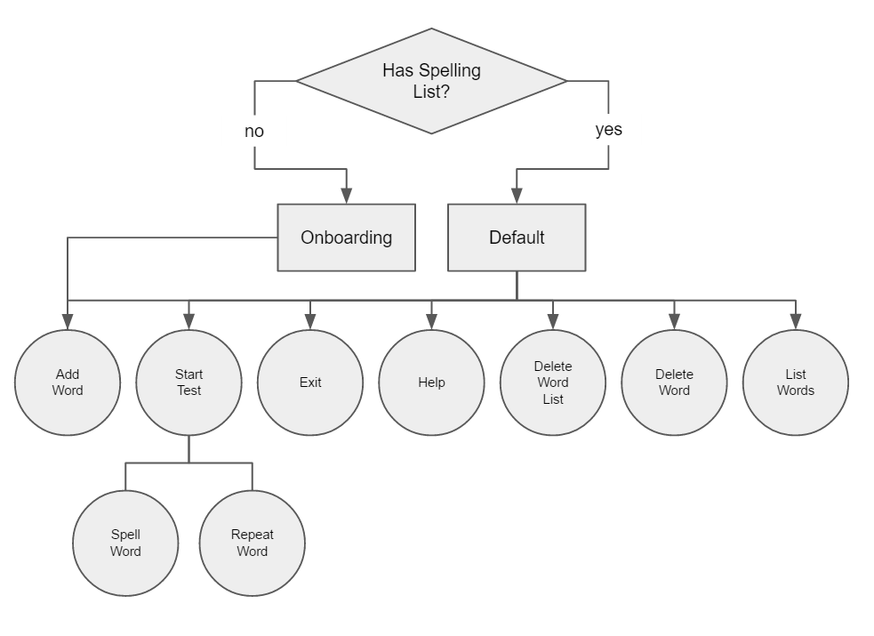
#### Dialog
```
User: "Alexa, open Spell Master"
Spell Master (onboarding): "Welcome to Spell Master. To get started you will first need to add words to your spelling list. To do this, say, add word."
Spell Master (default): "Welcome to Spell Master. You can say, start spelling test, add word, delete word, read spelling list, or help. What would you like to do?"
```

### Add Word
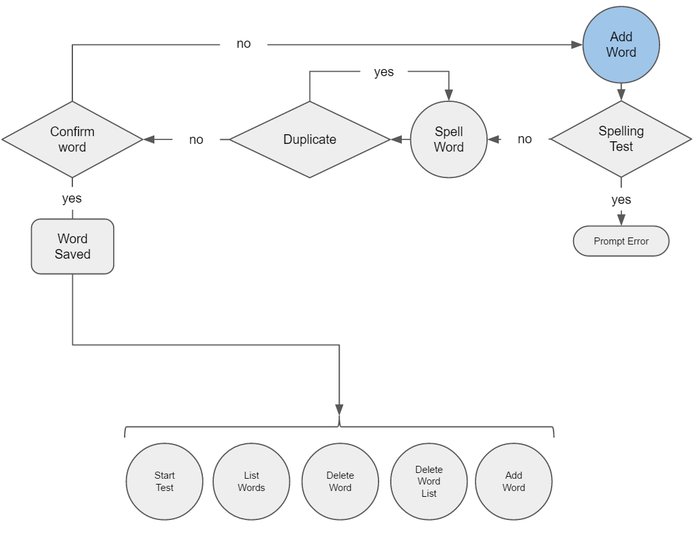
#### Dialog
```
User: "Add word"
Spell Master (test in progress): "Your spelling test is in progress to complete this action you will first need to end your spelling test. To do this, say, end spelling test."
Spell Master: "Please spell the word you would like to add to your spelling list."
User: "C L I M B I N G"
Spell Master: "Should I add the word, climbing?"
User: "Yes / No"
Spell Master (if yes): "Climbing, has been added. You can say, start spelling test, add word, delete word, read spelling list, or help. What would you like to do?"
Spell Master (if no): "Climbing, has not been added to your spelling list. You can say, start spelling test, add word, delete word, read spelling list, or help. What would you like to do?"
Spell Master (if duplicate): "Climbing, has already been added to your spelling list. You can say, start spelling test, add word, delete word, read spelling list, or help. What would you like to do?"
```

### Delete Word
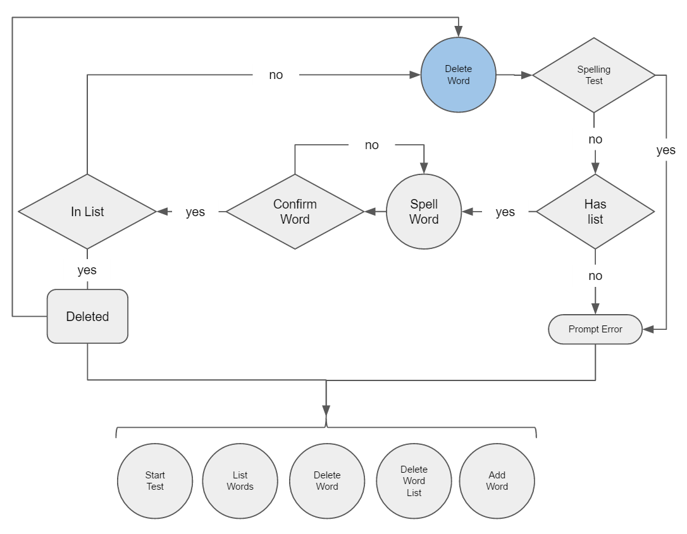
#### Dialog
```
User: "Delete word"
Spell Master (no words in list): "I am unable complete this action. To get started you will first need to add words to your spelling list. To do this, say, add word."
Spell Master (test in progress): "Your spelling test is in progress to complete this action you will first need to end your spelling test. To do this, say, end spelling test."
Spell Master: "Please spell the word you would like to delete from your spelling list."
User: "C L I M B I N G"
Spell Master: "Should I delete the word, climbing?"
User: "Yes / No"
Spell Master (if yes): "Climbing, has been deleted. You can say, start spelling test, add word, delete word, read spelling list, or help. What would you like to do?"
Spell Master (if no): "Climbing, has not been deleted. You can say, start spelling test, add word, delete word, read spelling list, or help. What would you like to do?"
Spell Master (if not in list): "Climbing, is not in your spelling list. You can say, start spelling test, add word, delete word, read spelling list, or help. What would you like to do?"
```

### Delete Spelling List
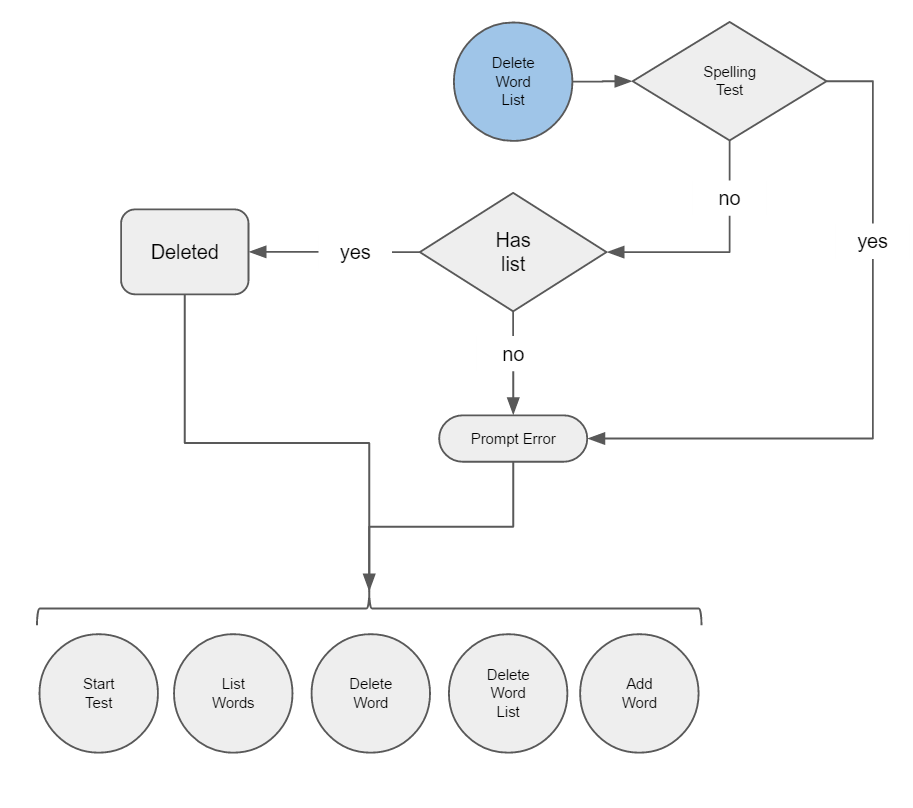
#### Dialog
```
User: "Delete spelling list"
Spell Master (no words in list): "I am unable complete this action. To get started you will first need to add words to your spelling list. To do this, say, add word."
Spell Master (test in progress): "Your spelling test is in progress to complete this action you will first need to end your spelling test. To do this, say, end spelling test."
Spell Master: "All words have been deleted. To get started you will first need to add words to your spelling list. To do this, say, add word."
```

### List/Read Words In Spelling List
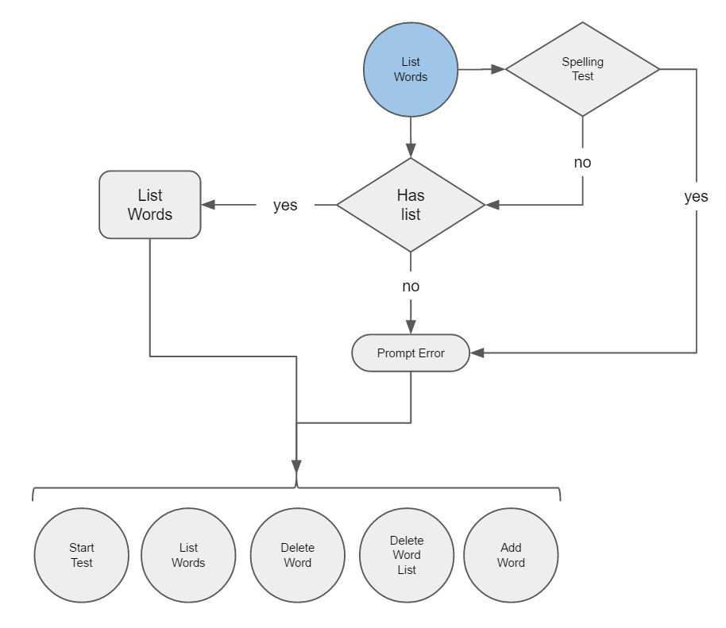
#### Dialog
```
User: "List words"
Spell Master (no words in list): "I am unable complete this action. To get started you will first need to add words to your spelling list. To do this, say, add word."
Spell Master (test in progress): "Your spelling test is in progress to complete this action you will first need to end your spelling test. To do this, say, end spelling test."
Spell Master: "You have 10 words in your spelling list. Listing words: Climbing, Crumbs, ...You can say, start spelling test, add word, delete word, list all words, or help. What would you like to do?"
```

### Start Spelling Test
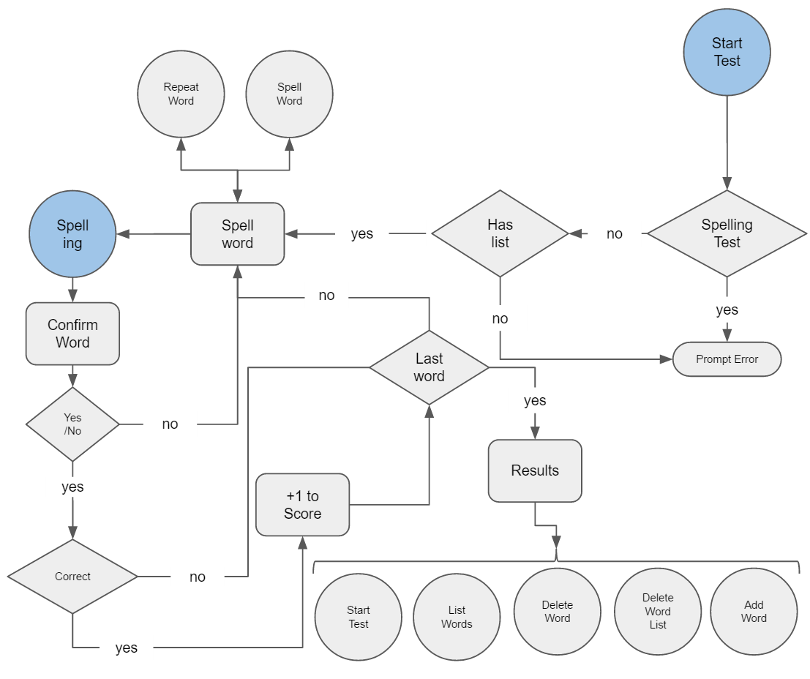
#### Dialog
```
User: "Start spelling test"
Spell Master (no words in list): "I am unable complete this action. To get started you will first need to add words to your spelling list. To do this, say, add word."
Spell Master (test in progress): "Your spelling test is in progress to complete this action you will first need to end your spelling test. To do this, say, end spelling test."
Spell Master: "At any time you can say, repeat word, spell word, or stop spelling test. Starting spelling test. Spell: climbing."
User: "C L I M B I N G "
Spell Master: "You said, C L I M B I N G, is that correct?"
User: "Yes" // If no ask to spell word again
Spell Master (if correct): "Correct!"
Spell Master (if incorrect): "Incorrect."
Spell Master: "Next word. Spell: crumbs."
User: "C R U M B S"
...
Spell Master: "End of spelling test. You scored 7 out of 10. You can say, start spelling test, add word, delete word, list all words, or help. What would you like to do?"
```

### Spell Word
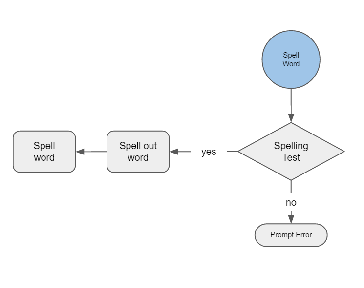
#### Dialog
```
User: "Spell it for me"
Spell Master: "Spell: climbing."
Spell Master (test not in progress): "I am unable complete this action."
```

### Repeat Word
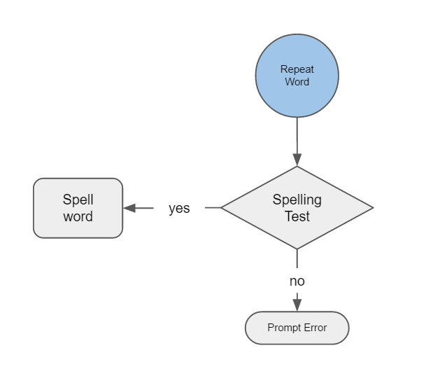
#### Dialog
```
User: "Repeat word"
Spell Master: "Climbing is spelt, C L I M B I N G, now your turn."
Spell Master (test not in progress): "I am unable complete this action."
```

### Help
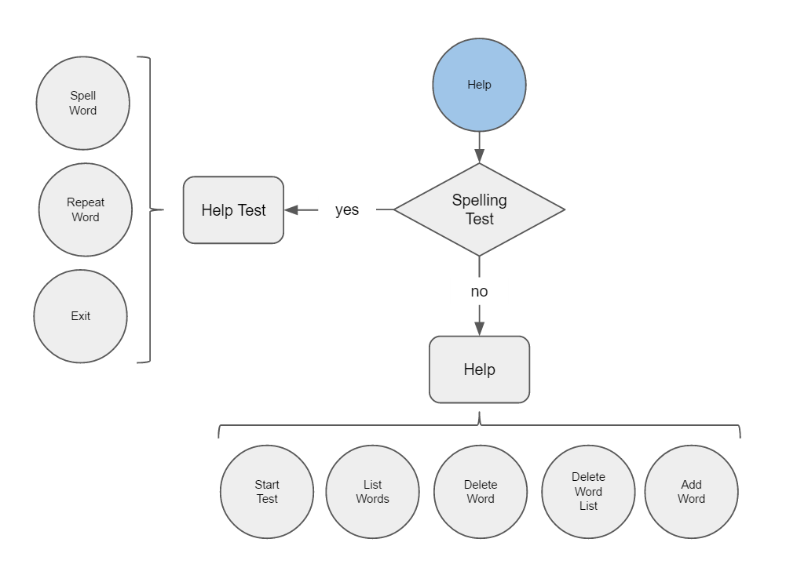
#### Dialog
```
User: "Help"
Spell Master (test in progress): "At any time you can say, repeat word, spell word, or end spelling test."
Spell Master (test not in progress): "You can say, start spelling test, add word, delete word, read spelling list, or delete spelling list."
```

### Exit
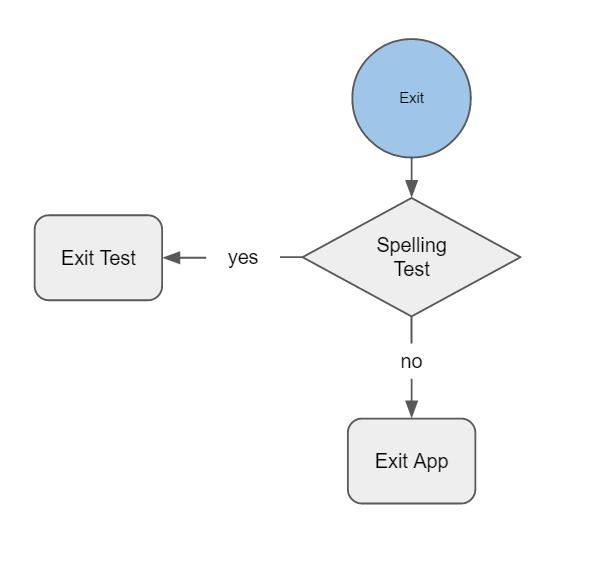
#### Dialog
```
User: "Exit"
Spell Master (test in progress): "Ending spelling test. You can say, start spelling test, add word, delete word, list all words, or help. What would you like to do?"
Spell Master (test not in progress): "Good-bye."
```

## Setup

### Requirements


## Resources:

### Alexa and AWS:
- [Intent Schema & Sample Utterances](https://developer.amazon.com/public/solutions/alexa/alexa-skills-kit/docs/defining-the-voice-interface)
- [Custom Interaction Model Reference](https://developer.amazon.com/public/solutions/alexa/alexa-skills-kit/docs/alexa-skills-kit-interaction-model-reference)
- [Alexa Skills Kit Voice Design Handbook](https://developer.amazon.com/public/solutions/alexa/alexa-skills-kit/docs/alexa-skills-kit-voice-design-handbook)
- [Alexa Skills Kit Voice Design Best Practices](https://developer.amazon.com/public/solutions/alexa/alexa-skills-kit/docs/alexa-skills-kit-voice-design-best-practices)
- [Skills Kit Samples](https://github.com/amzn/alexa-skills-kit-js)
- [Awesome Amazon Echo - collection of resources](https://github.com/miguelmota/awesome-amazon-echo)
- [AWS-SDK-JS](https://github.com/aws/aws-sdk-js)
- [SSML Reference](https://developer.amazon.com/public/solutions/alexa/alexa-skills-kit/docs/speech-synthesis-markup-language-ssml-reference)

### Dictionaries / Word Lists:
- [English Word List](https://github.com/dwyl/english-words)
- [English Spelling Dictionaries](http://phillipmfeldman.org/English/spelling%20dictionaries.html)
- [Dictionaries by Grade Level](http://www.ideal-group.org/dictionary/)

## TODO:
- Support British / American English
- Improve VUI (dialog flow)