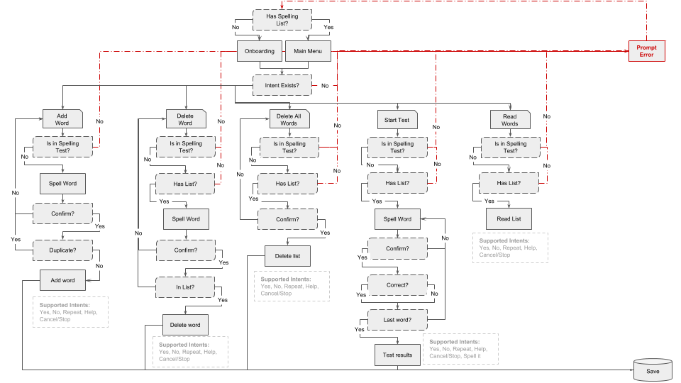

# 

> Master your spelling with “Spell Master”. A simple Alexa Skill to help you practice for your spelling tests.

## Purpose:
To allow 6 year-olds and up to study independently for their school's spelling tests using a device connected to Amazon's Alexa Voice Service (e.g. Amazon Echo).

### Features:
- Recognizes more than 24,000 kid-safe words
- Edit your spelling list by adding and deleting words
- Practice your spellings with a spelling test

### Published Skill:
To use the published Spell Master skill you need to [enable it from the Alexa app/website](http://alexa.amazon.com/spa/index.html#skills/dp/B01K72RH8S/?ref=skill_dsk_skb_sr_0). If the link does not work you can [seach for it](http://alexa.amazon.com/spa/index.html#skills) with the search term "Spell Master".

## Roll It As Your Own Skill: 
1. Create an `auth.json` file inside the `src` folder. It should look like the below. Remember to replace the APP_ID value with your own Application Id when you have created one.
```json
{ 
    "SKILL_NAME": "Spell Master",
    "APP_ID": "amzn1.echo-sdk-ams....",
    "TABLE_NAME": "SpellMasterData"
}
```
2. Run `npm install` inside the `src` folder to download the [Alexa Skills Kit SDK for Node.js](https://github.com/alexa/alexa-skills-kit-sdk-for-nodejs/)
2. Create a Lambda function and Amazon Resource Name (ARN) by following **Step 1** on [Amazon's Node.js quick start guide for Alexa Skills](https://developer.amazon.com/public/solutions/alexa/alexa-skills-kit/alexa-skill-nodejs-quick-start)
    - **Note:** There is no need to select a blue print as suggested (see [Step 1.f](https://developer.amazon.com/public/solutions/alexa/alexa-skills-kit/alexa-skill-nodejs-quick-start)), you can press next and configure the trigger with Alexa Skill Kit. Once you have done this you can press next again to configure the function. Here you will have the option to select the **Code entry type**, select Upload a .ZIP file. You will want to .ZIP up all the files in the `src` folder. Make sure to .ZIP the files and not the directory. 
2. Add DynamoDB support:
    1. Go to the [AWS Console and click on DynamoDB](https://console.aws.amazon.com/dynamodb). **Make sure you are in the same region as your Lambda**
    1. Click on CreateTable and set "SpellMasterData" as the table name and "userId" for the primary key type.
    1. Continue the steps with the default settings to finish the setup.
    1. **Note:** You can create the table manually as outlined or let the Alexa Skill Kit SDK do it for you by giving your Lambda function DynamoDB create table permissions. 
3. Extending role permissions to allow the skill to use DynamoDB (I am sure there is a better way):
    1. Go to the [AWS Console and click on IAM](https://console.aws.amazon.com/iam/), then:
    1. Click on Roles 
    1. Click on the role you created. Mine was named "lambda-dynamodb-execution-role" (see [Step 1.i](https://developer.amazon.com/public/solutions/alexa/alexa-skills-kit/alexa-skill-nodejs-quick-start) on role creation)
    1. Under Inline Policies click on Create Role Policy
    1. Select Policy Generator then click on the Select button
    1. Effect should be set to Allow
    1. For AWS Service select Amazon DynamoDb
    1. For Actions select `GetItem` and `PutItem`
    1. Add your Amazon Resource Name (ARN) - you can find this on settings page of the Lambda function you created
    1. Click on Add Statement
2. Create an Alexa Skill by following **Step 2** on [Amazon's Node.js quick start guide for Alexa Skills](https://developer.amazon.com/public/solutions/alexa/alexa-skills-kit/alexa-skill-nodejs-quick-start)
    - The **Intent Schema** is inside the `speechAssets` folder (`speechAssets/IntentSchema.json`). 
    - **Sample Utterances** are inside the `speechAssets` folder (`speechAssets/SampleUtterances.txt`). 
    - This skill has one **Custom Slot Type**: `LIST_OF_SPELLINGS`. This is where you can edit the words that Spell Master supports. For example if you wanted to add support for the word `shin` you would include it as `s.h.i.n.`. All words in LIST_OF_SPELLINGS can be found here: `speechAssets/customSlotTypes/LIST_OF_SPELLINGS`
2. Test out your skill by following **Step 3** on [Amazon's Node.js quick start guide for Alexa Skills](https://developer.amazon.com/public/solutions/alexa/alexa-skills-kit/alexa-skill-nodejs-quick-start)

## Extend / Edit Skill
1. To add extra functionality edit the `index.js` file in the `./src` folder. 
    - Spell Master uses state based intent handling (thanks to the [Alexa Skills Kit SDK for Node.js](https://github.com/alexa/alexa-skills-kit-sdk-for-nodejs/)). This means you can set intent handlers to only work when the skill is in a specific state. Currently Spell Master supports the following states: `MENUMODE`, `ADDWORDMODE`, `DELETEWORDMODE`, `DELETELISTMODE`, `READLISTMODE`, and `SPELLTESTMODE`. Descriptions of these states can be found in the source code.
1. To edit the dialog of this skill edit the `dialog.json` file in the `./src` folder.
1. To support more words edit the `LIST_OF_SPELLINGS` Custom Slot Type. I created the initial list of 24,000 words by combining a few of the [dictionaries](http://phillipmfeldman.org/English/spelling%20dictionaries.html) compiled by Dr. Phillip M. Feldman.


## Dialog Sample:

```
User: "Alexa, open Spell Master"
Spell Master: "Welcome to Spell Master. You have added 0 words to your spelling list. To get started you will need to add words to it. To do this, say, add word."
User: "Add word"
Spell Master: "Please spell the word you would like to add."
User: "C L I M B I N G"
Spell Master: "Do you want me to add the word, climbing?"
User: "Yes"
Spell Master: "Climbing, has been added. Please spell another word you would like to add or say cancel."
User: "Cancel"
Spell Master: "You have added 1 word to your spelling list. You can say, start spelling test, add word, delete word, read spelling list, or delete spelling list. What would you like to do? 
User: "Start spelling test"
...
```

## Voice User Interface (VUI) Diagram:



## Setup Requirements:
- [AWS Lambda](https://aws.amazon.com/lambda/) to run Alexa Skill function
- [Amazon DynamoDB](https://aws.amazon.com/dynamodb/) to store the spelling test data
- [Alexa Skills Kit](https://developer.amazon.com/ask) makes it easy to add skills to Alexa
- [Alexa Voice Service](https://developer.amazon.com/public/solutions/alexa/alexa-voice-service) helps to voice-enable any connected product
- [Raspberry Pi](https://www.raspberrypi.org/products/) for setting up with Alexa Voice Service (e.g. creating an Echo) so you can use as a use Alexa Skill testing tool
- [Node.js](https://nodejs.org/en/) for building the skill

## Alexa and AWS Resources:
- [Alexa Skills Kit SDK for Node.js](https://github.com/alexa/alexa-skills-kit-sdk-for-nodejs)
- [Intent Schema & Sample Utterances](https://developer.amazon.com/public/solutions/alexa/alexa-skills-kit/docs/defining-the-voice-interface)
- [Custom Interaction Model Reference](https://developer.amazon.com/public/solutions/alexa/alexa-skills-kit/docs/alexa-skills-kit-interaction-model-reference)
- [Alexa Skills Kit Voice Design Handbook](https://developer.amazon.com/public/solutions/alexa/alexa-skills-kit/docs/alexa-skills-kit-voice-design-handbook)
- [Alexa Skills Kit Voice Design Best Practices](https://developer.amazon.com/public/solutions/alexa/alexa-skills-kit/docs/alexa-skills-kit-voice-design-best-practices)
- [Skills Kit Samples](https://github.com/amzn/alexa-skills-kit-js)
- [Awesome Amazon Echo - collection of resources](https://github.com/miguelmota/awesome-amazon-echo)
- [AWS-SDK-JS](https://github.com/aws/aws-sdk-js)
- [SSML Reference](https://developer.amazon.com/public/solutions/alexa/alexa-skills-kit/docs/speech-synthesis-markup-language-ssml-reference)
- [Echosim.io](https://Echosim.io) if you don't have a Raspberry Pi or Echo use this for testing your Alexa Skill.

## Dictionaries / Word Lists:
- [English Word List](https://github.com/dwyl/english-words)
- [English Spelling Dictionaries](http://phillipmfeldman.org/English/spelling%20dictionaries.html)
- [Dictionaries by Grade Level](http://www.ideal-group.org/dictionary/)

## TODO:
- Add support for Cards